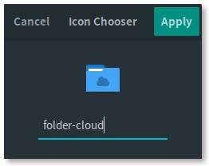

# nautilus-folder-icons

Nautilus/Nemo extension that makes changing folders icons easy!

[](https://www.paypal.me/BilalELMoussaoui)

## Screenshots

<div align="center"></div>

## Shortcuts

- <kbd>Escape</kbd> To close the window
- <kbd>Return</kbd> To select the new folder icon
- <kbd>Shift</kbd>+<kbd>Ctrl</kbd>+<kbd>S</kbd> To open the folder icon selector on the current folder

## Requirements

### Running dependencies

- `python2`

#### For Nautilus

- `nautilus-python`:
  - Archlinux : `python2-nautilus`

#### For Nemo

- `nemo-python`:
  - Archlinux : `nemo-python`

### Building dependencies

- `meson` >= `0.40.0`
- `ninja`
- `appstream-glib`

## How to install

### Arch Linux

#### Nautilus

```bash
yaourt -S nautilus-folder-icons
```

### Manual installation

1- Install requirements

2- Clone the repository

```bash
git clone https://github.com/bil-elmoussaoui/nautilus-folder-icons
```

3- Build it!

```bash
cd nautilus-folder-icons
meson builddir --prefix=/usr -Dfile_manager=[nautilus|nemo]
sudo ninja -C builddir install
```

4- Restart Nautilus/Nemo

```bash
nautilus -q
nemo -q
```

## How to uninstall

```bash
sudo ninja -C builddir uninstall
```

## Contribute

### Translations

In order to generate the pot file, run the following commands:

```bash
meson builddir --prefix=/usr
ninja nautilus-folder-icons-update-po
```

A `.pot` will be generated on `./po` which can be translated using Poedit. The PR should contain only the `.po` file
